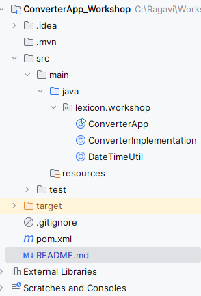

# Converter Application

This is a console-based Java application that converts values between different units such as,
1. Currency Converter
2. Temperature Converter
3. Length Converter
4. BMI Calculator

I have designed this application with 3 classes.
1) ConverterApp -- It is the main class of the application, which has all the menu's and directions to process the conversion.
2) ConverterImplementation -- It is the implementation class for all the conversion designed in the application.
3) DateTimeUtil -- It is a helper utility class, which has the datetime formatter and used to display in the result of every conversion.

_Below is the Project structure of the application:_

